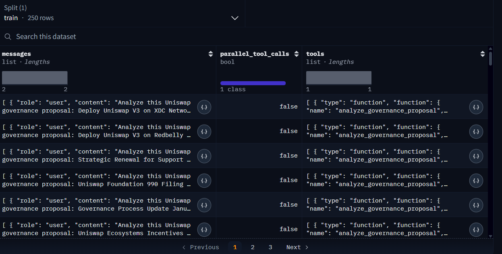
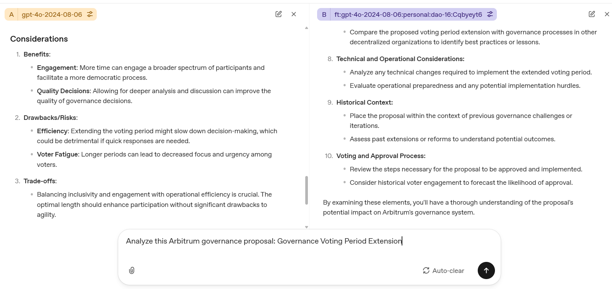

# 🏛️ Decoding Decentralized Governance: Fine-Tuning LLMs for DAO Analysis

**Fine-tuning GPT-4o to analyze organizational innovation in Decentralized Autonomous Organizations (DAOs)**

---





---

## 📋 Overview

Decentralized Autonomous Organizations (DAOs) represent a radical shift from hierarchical organizations to community-driven, on-chain governance. This project fine-tunes **GPT-4o** into a specialized _Innovation Auditor_ for Web3 organizations, capable of:

- Analyzing DAO governance proposals
- Identifying and categorizing organizational and technical innovations
- Scaling qualitative analysis across large volumes of proposals

**Problem:**  
Traditional governance analysis is slow, manual, and subject to human bias. General-purpose LLMs often lack DAO-specific context and vocabulary.

**Solution:**  
A domain-specific fine-tuned GPT-4o model, trained on **250 real DAO governance proposals**, to deliver more accurate, consistent, and context-aware analysis.

---

## 📊 Dataset

- **Source DAOs (5):** Uniswap, Aave, MakerDAO, Optimism, Arbitrum  
- **Number of proposals:** 250  
- **Proposal types (19):**
  - Governance design & meta-governance  
  - Protocol upgrades & parameter changes  
  - Grants & ecosystem funding  
  - Treasury management & budget allocation  
  - Security, risk, and incident response  
- **Time period:** December 2024 – December 2025  
- **Format:** `JSONL` compatible with OpenAI fine-tuning API  
- **Hosting:** Hugging Face Datasets

**Dataset link:**  
[DAOs Governance Dataset on Hugging Face](https://huggingface.co/datasets/arad1367/DAOs)

---

## 🤖 Models

| Role        | Model ID                                              | Purpose                          |
|------------|--------------------------------------------------------|----------------------------------|
| Base       | `gpt-4o-2024-08-06`                                   | General-purpose LLM              |
| Fine-tuned | `ft:gpt-4o-2024-08-06:personal:dao-16:Cqbyeyt6`       | DAO governance specialist        |

The fine-tuned model is optimized to:

- Recognize DAO-specific structures (proposal templates, voting mechanisms, roles)
- Classify proposal types and innovation categories
- Evaluate governance clarity and execution feasibility
- Surface innovation-related signals (novel mechanisms, incentive designs, coordination primitives)

---

## 🔧 Training Configuration

- **Training tokens:** 68,287  
- **Epochs:** 1  
- **Batch size:** 16  
- **Learning rate multiplier:** 2  
- **Format:** OpenAI fine-tuning `JSONL` (instruction → response pairs)

The configuration is chosen to avoid overfitting on a relatively small but high-signal governance dataset while still adapting the model to DAO-specific language and patterns.

---

## 📈 Evaluation

Evaluation combines **technical metrics** and **LLM-as-a-Judge qualitative assessment**.

### Technical Metrics

- Cosine Similarity  
- ROUGE-L  
- Perplexity  
- Word Count  
- Token Usage  
- BERTScore  
- METEOR  
- BLEU  

### Qualitative Metrics (LLM-as-a-Judge)

- **Innovation Relevance** – Does the response correctly identify and discuss innovation aspects?  
- **Governance Clarity** – Is the explanation actionable and understandable for DAO stakeholders?  
- **Technical Accuracy** – Are protocol and governance details correctly interpreted?

The evaluation compares **base GPT-4o** vs the **fine-tuned DAO model** across these metrics.

---

## 📧 Contact
- Author: Pejman Ebrahimi
- Email: pejman.ebrahimi77@gmail.com

* Feel free to reach out for collaboration, questions, or extensions to other DAO ecosystems.

```bash
pip install openai pandas matplotlib seaborn scikit-learn rouge-score bert-score nltk
